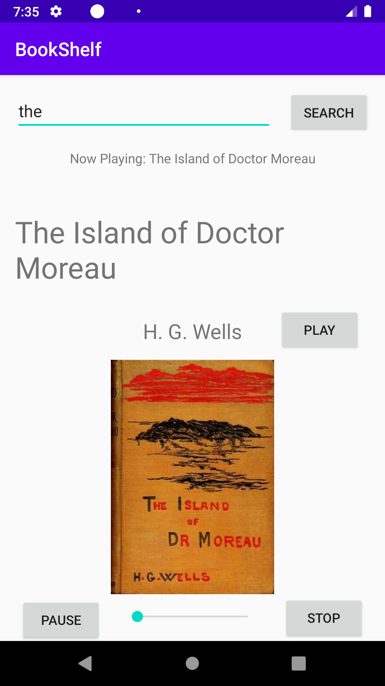
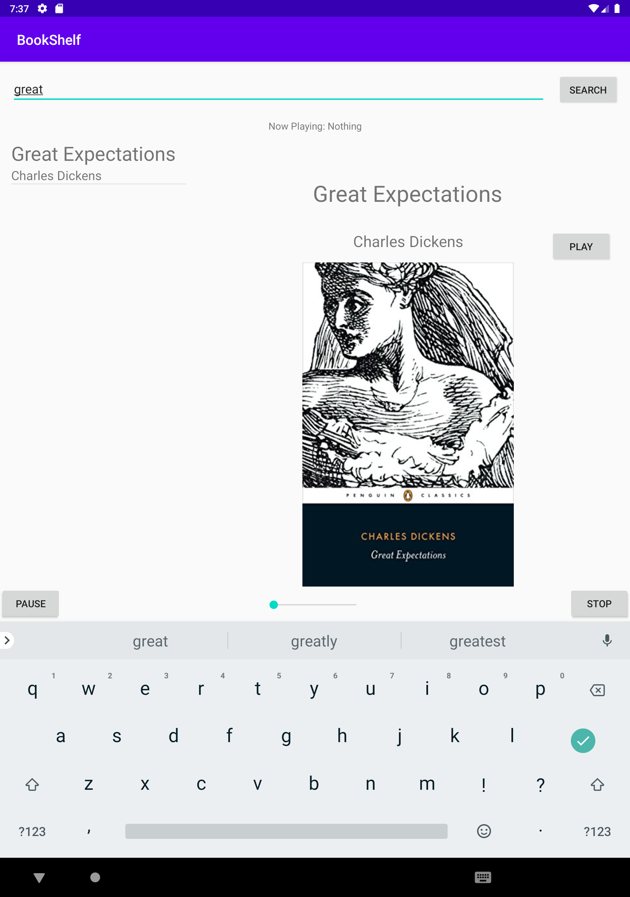

# BOOKSHELF AUDIO

The application will allow a user to play the audio from any book in the collection available on the web service. My goal will be to integrate the library, and thereafter provide controls and feedback to the user when playing an audio-book.

# Phone 

# Tablet

